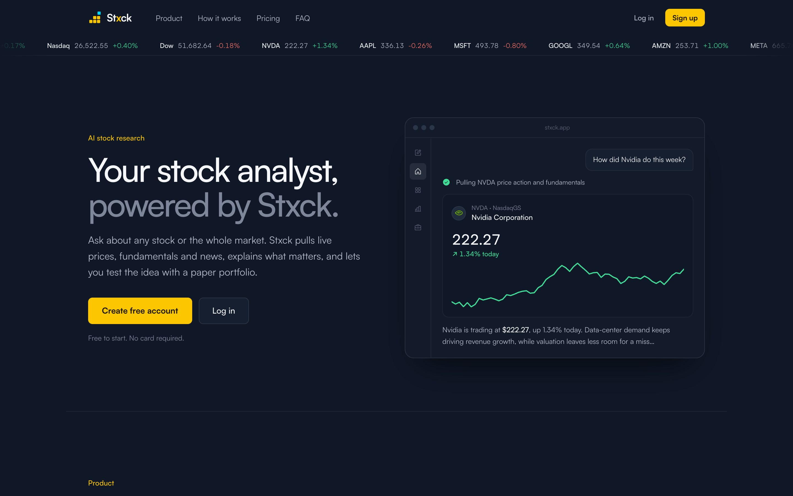
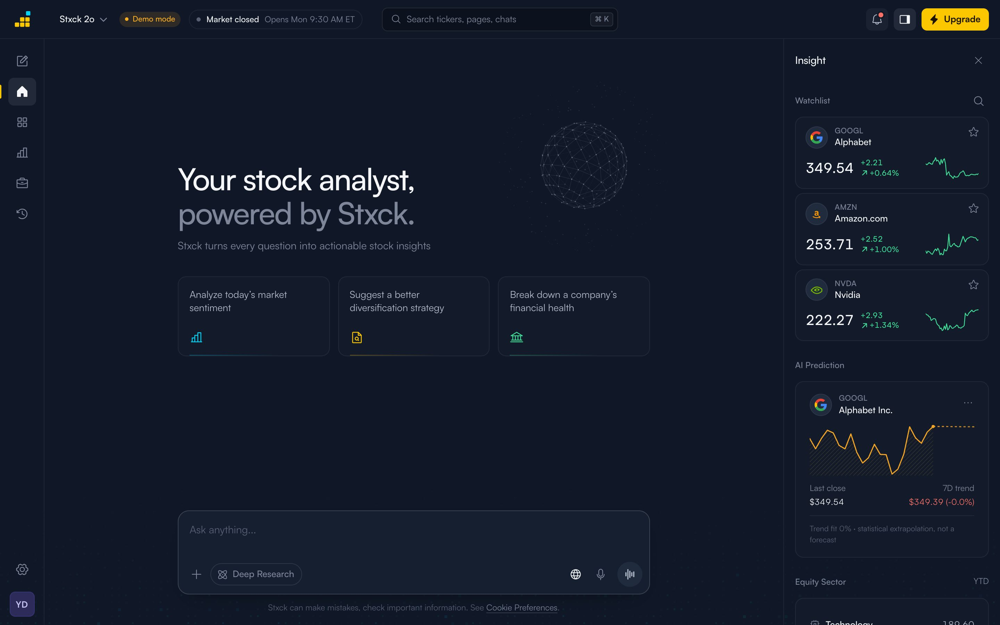
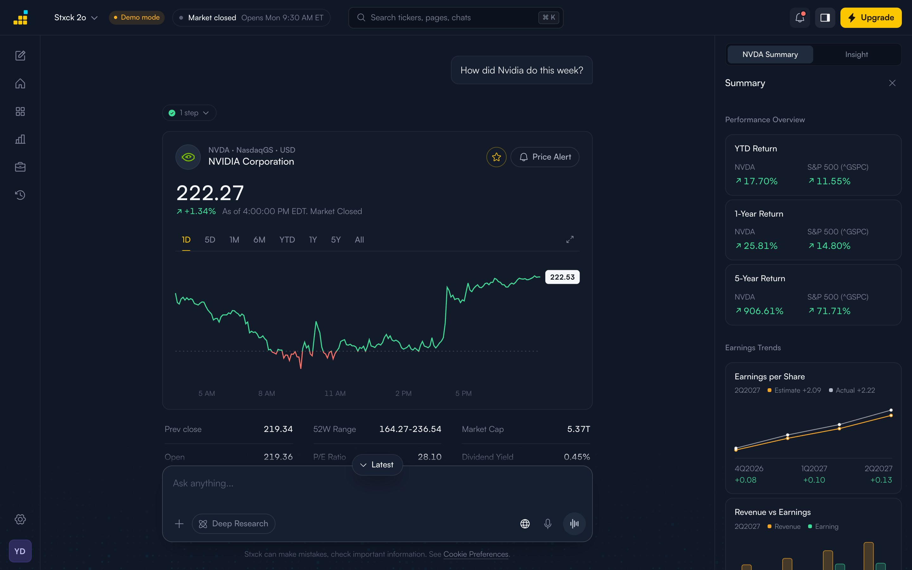
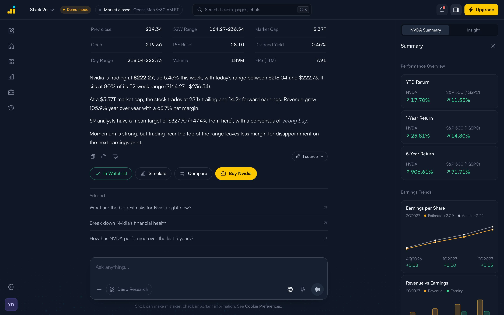
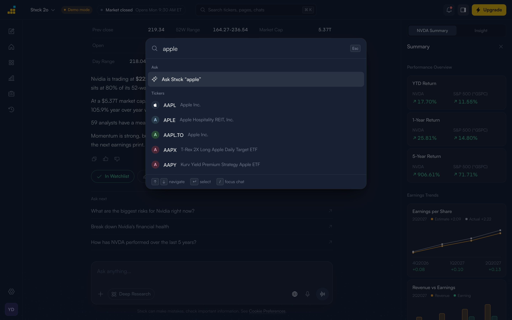
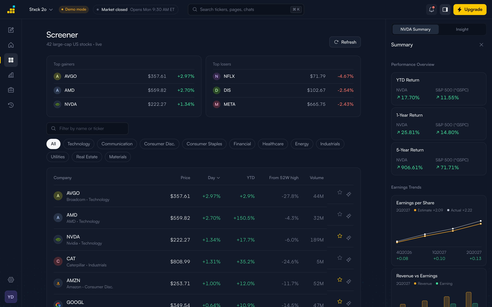
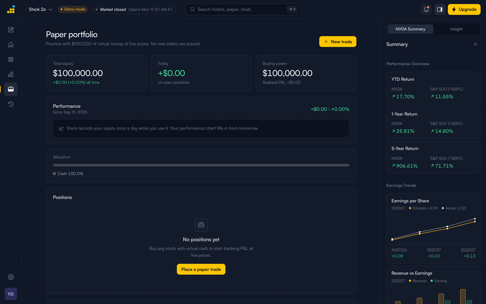
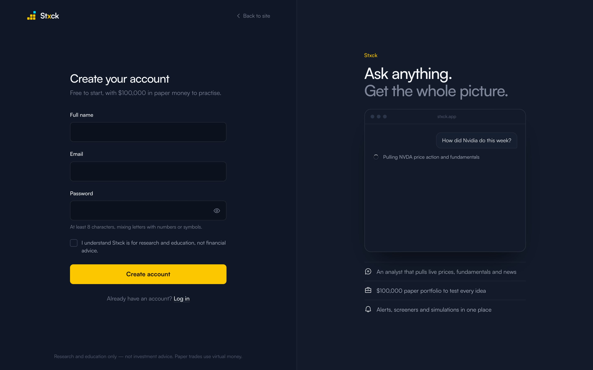
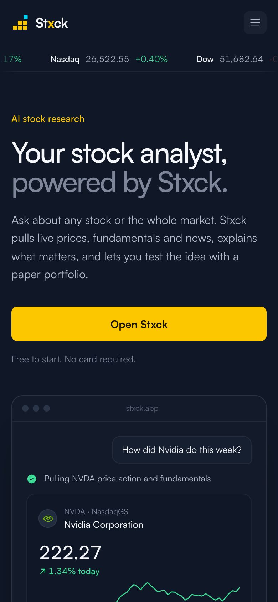
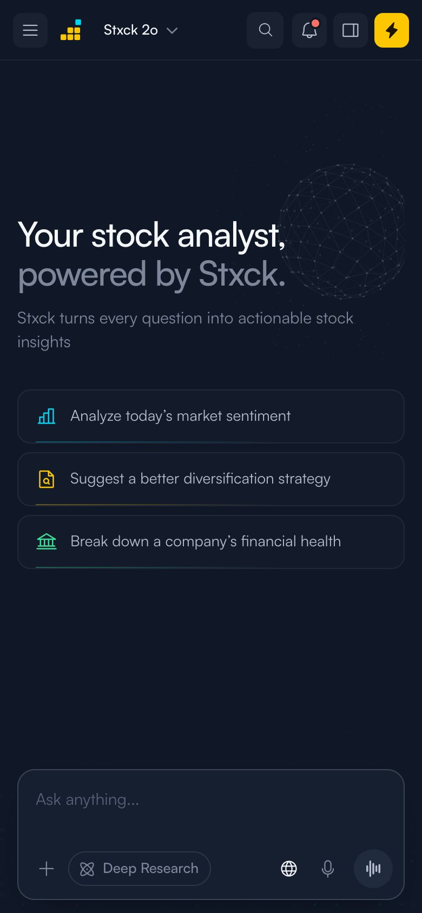

<p align="center">
  
</p>

<p align="center">
  <b>An AI stock analyst you can talk to.</b><br />
  Ask about any company or the market. Stxck pulls live prices, fundamentals and news, explains what matters with sources,<br />
  and lets you act on it with a watchlist, price alerts, a simulator and a $100,000 paper portfolio.
</p>

<p align="center">
  
  
  
  
  
  
</p>

<p align="center">
  <a href="https://render.com/deploy?repo=https://github.com/iamyugant/stxck"></a>
</p>

> **Research and education only — not investment advice.** Paper trades use virtual money; no brokerage is connected. Market data may be delayed.

---

## Contents

1. [Screenshots](#screenshots)
2. [Highlights](#highlights)
3. [Quick start](#quick-start)
4. [A two-minute tour](#a-two-minute-tour)
5. [Configuration](#configuration)
6. [Feature reference](#feature-reference)
7. [Keyboard shortcuts](#keyboard-shortcuts)
8. [Tech stack](#tech-stack)
9. [Architecture](#architecture)
10. [The AI analyst](#the-ai-analyst)
11. [API reference](#api-reference)
12. [Data model and storage](#data-model-and-storage)
13. [Design system](#design-system)
14. [Security](#security)
15. [Testing](#testing)
16. [Deployment](#deployment)
17. [Troubleshooting](#troubleshooting)
18. [Project history (agile log)](#project-history-agile-log)
19. [Limitations and roadmap](#limitations-and-roadmap)
20. [Contributing](#contributing)

---

## Screenshots

<table>
  <tr>
    <td colspan="2"><br /><sub><b>Landing page</b> — live ticker tape and a self-playing product preview.</sub></td>
  </tr>
  <tr>
    <td width="50%"><br /><sub><b>Home</b> — prompts, composer, live watchlist, trend card and sector performance.</sub></td>
    <td width="50%"><br /><sub><b>Analysis</b> — interactive price card, key stats and the Summary rail.</sub></td>
  </tr>
  <tr>
    <td width="50%"><br /><sub><b>Answer</b> — streamed text, sources, one-tap actions and “Ask next”.</sub></td>
    <td width="50%"><br /><sub><b>⌘K palette</b> — pages, actions, live ticker search and chats.</sub></td>
  </tr>
  <tr>
    <td width="50%"><br /><sub><b>Screener</b> — 42 large caps, movers, sector filters and sorting.</sub></td>
    <td width="50%"><br /><sub><b>Paper portfolio</b> — equity, day P&amp;L, performance, positions and alerts.</sub></td>
  </tr>
  <tr>
    <td width="50%"><br /><sub><b>Sign up</b> — inline validation, password strength and a live brand panel.</sub></td>
    <td width="50%">
      
      <br />
      <sub><b>Mobile</b> — full-bleed layout, slide-out menu, bottom-sheet modals.</sub>
    </td>
  </tr>
</table>

---

## Highlights

- **Conversational research with receipts.** A Claude agent calls 11 market tools and shows every step, card and source it used.
- **Live market data everywhere.** Quotes, 8-timeframe charts, fundamentals, sector ETFs and a screener, all live.
- **Act on insight.** Watchlist, price alerts, a backtest simulator and paper trading, reachable from any answer.
- **Built like a product.** Accounts, onboarding, a ⌘K palette, a market-hours indicator, offline and session-expiry states, and designed loading, empty and error states.
- **Works without an AI key.** Demo mode keeps the whole UI and live data running on templated answers.
- **Secure by default.** scrypt passwords, signed HttpOnly cookies, strict CSP, rate limits and zod validation.

---

## Quick start

**Requirements:** Node.js 22.9+ (24 recommended) and npm.

```bash
git clone https://github.com/iamyugant/stxck.git
cd stxck
npm install
cp .env.example .env       # optional: add ANTHROPIC_API_KEY for full AI answers
npm run dev                # → http://localhost:5173
```

Create an account, choose your investing style and a starter watchlist, and ask your first question.

> **Demo mode.** Without `ANTHROPIC_API_KEY`, Stxck answers structured questions from templates: a company ("How did Nvidia do this week?"), comparisons ("Compare NVDA vs AMD"), simulations ("What if I invested $5,000 in MSFT"), market mood and diversification. It still uses live data. A **Demo mode** badge appears in the top bar. Add a key to `.env` at any time: the dev server picks it up within about a second, and the app switches over without a reload.

### Scripts

| Script | What it does |
| --- | --- |
| `npm run dev` | Express API + Vite with hot reload, on one port |
| `npm run build` | Production frontend build into `dist/` |
| `npm start` | Production server: serves `dist/` and the API |
| `npm run preview` | Build, then start the production server |
| `npm test` | Test suite (`node:test`), 17 tests |
| `npm run lint` | oxlint |

---

## A two-minute tour

1. **Sign up** at `/signup`. Onboarding asks how you invest (long-term, active, income or learning) and seeds your watchlist.
2. **Ask** "How did Nvidia do this week?" A step appears ("Pulling NVDA price action…"), then a price card with chart and stats, a streamed explanation, its sources and action buttons.
3. **Act.** Tap **Add to Watchlist**, **Simulate** (backtest $10k), **Compare**, or **Buy Nvidia** to open a paper-trade ticket.
4. **Go deeper.** Pick one of the **Ask next** questions, or open the **NVDA Summary** rail for returns vs the S&P 500 and earnings trends.
5. **Explore.** Press **⌘K**, type "apple" and hit Enter for the Charts view. Open **Screener** for today's movers, or **Portfolio** to see P&L and set price alerts.
6. **Pick up later.** **History** keeps every chat, grouped by date and exportable as Markdown.

---

## Configuration

Environment variables are read from `.env` (loaded automatically; hot-reloaded in development).

| Variable | Required | Default | Purpose |
| --- | --- | --- | --- |
| `ANTHROPIC_API_KEY` | For AI answers | — | Enables the Claude analyst. Without it, demo mode. |
| `STXCK_MODEL` | No | `claude-opus-5` | Claude model used by the analyst (`NERVE_MODEL` still honoured). |
| `SESSION_SECRET` | Production | auto-generated | HMAC secret for session cookies. Auto-generated into `DATA_DIR` if unset. |
| `DATA_DIR` | No | `./data` | Holds `users.json` and the generated secret. Mount a volume in production. |
| `RESEND_API_KEY` | No | — | Sends password-reset emails via Resend. |
| `MAIL_FROM` | With Resend | — | Sender, e.g. `Stxck <no-reply@yourdomain.com>`. |
| `PORT` | No | `5173` | HTTP port. |
| `NODE_ENV` | No | — | `production` enables static hosting, CSP, HSTS and secure cookies. |

Without an email provider, reset links are printed to the server log. In development they're also shown on the "Check your inbox" screen.

---

## Feature reference

### Conversation
| | |
| --- | --- |
| **Streaming answers** | Word-by-word text, a live tool timeline, cards inserted where results arrive, and a blinking caret while writing. |
| **Cards** | Price (8 timeframes, split up/down colouring, last-price label, tooltip), stats grid, comparison table, fundamentals, market overview, simulation. |
| **Sources** | A "N sources" pill expands into a numbered list of links. |
| **Ask next** | Three follow-up questions after stock answers. |
| **Actions** | Watchlist, Simulate, Compare, Buy (paper). The agent can also add to the watchlist, set alerts or open a trade ticket, but only when asked. |
| **Controls** | Stop, retry on error, copy, thumbs up/down, jump to latest. |
| **Modes** | Stxck 2o / mini / Reasoning (medium / low / high effort), Web search, Deep Research. |
| **Input** | Multi-line composer, image/PDF/CSV/TXT/JSON attachments, voice dictation. |

### Market
| | |
| --- | --- |
| **Insight rail** | Live watchlist with price-tick flashes, a 7-day trend card (least-squares fit, labelled as not a forecast), sector ETF YTD bars. |
| **Summary rail** | Appears after an analysis: YTD / 1Y / 5Y vs S&P 500, EPS actual vs estimate, revenue vs earnings. |
| **Screener** | 42 large caps: price, day %, YTD %, distance from the 52-week high, volume. Sector chips, sort, text filter, top movers. |
| **Charts** | Any ticker, key stats, a fundamentals card, and quick actions (ask, simulate, trade). |
| **Market status** | Pre-market / open / after hours / closed / holiday, with a countdown. |

### Portfolio and alerts
| | |
| --- | --- |
| **Paper trading** | Market orders at live quotes, in shares or dollars; average-cost basis; oversell and overdraft guards. |
| **Portfolio view** | Total equity, today's P&L, buying power, realized P&L, performance chart (daily equity), allocation bar, positions with a Today column, activity log. |
| **Price alerts** | Above/below targets with ±5/10% shortcuts. Checked every minute while open; in-app, bell and desktop notifications; manage everything in Portfolio. |
| **Simulator** | Lump-sum backtest (1–10 years): value path, CAGR, max drawdown, volatility, and a 10th–90th percentile projection band. |

### Accounts
| | |
| --- | --- |
| **Auth** | Sign up, log in (remember me), forgot and reset password, session-expired notice. |
| **Onboarding** | Investing style → watchlist → summary; skippable. |
| **Settings** | Name, password, log out, delete account; default web/deep modes; desktop notifications; export all data (JSON); erase local data. |
| **History** | Grouped by date, full-text search, rename, delete, export to Markdown. |

---

## Keyboard shortcuts

| Keys | Action |
| --- | --- |
| `⌘K` / `Ctrl K` | Open the command palette |
| `/` | Focus the chat composer (from anywhere) |
| `Enter` · `Shift Enter` | Send · new line |
| `↑` `↓` `Enter` | Move and select in the palette, ticker search and menus |
| `Esc` | Close the palette, menus and modals |

---

## Tech stack

| Layer | Choice | Why |
| --- | --- | --- |
| UI | React 19, Vite 8, hand-written CSS on design tokens | Full control over the visual system; no CSS framework to fight. |
| Charts | Recharts + custom SVG sparklines | Interactive main charts; tiny, fast sparklines. |
| Icons | Phosphor (regular / bold / fill) | One consistent family with weight-based states. |
| Server | Node + Express 5 | One process serves the API, the SSE stream and the SPA (Vite middleware in dev). |
| AI | Anthropic SDK, Claude Opus 5 | Adaptive thinking, tool use, web search, server-side refusal fallback. |
| Validation | zod | Tool inputs and auth payloads. |
| Markdown | marked + DOMPurify | Rich answers, safely sanitized. |
| Market data | Yahoo Finance public endpoints | Quotes, charts, search/news and fundamentals without a paid key. |

---

## Architecture

```
┌────────────────────────── Browser (React SPA) ───────────────────────────┐
│ Root router: / · /login · /signup · /forgot · /reset · /welcome · /app    │
│ App shell: TopBar · Nav rail · Chat | Screener | Charts | Portfolio |     │
│            History · Insight/Summary rail · Modals · ⌘K palette           │
│ State: useChat (SSE, per-frame batching) · useAccount (portfolio, alerts, │
│        watchlist, equity history) → localStorage, scoped per user          │
└──────────────┬──────────────────────────────────────────▲────────────────┘
               │ fetch / POST /api/chat                    │ text/event-stream
┌──────────────▼──────────────────── Express ─────────────┴────────────────┐
│ security headers · compression · attachUser · sameOrigin · rate limits    │
│ /api/auth/*  → auth.js (scrypt, HMAC cookies, reset tokens, users.json)   │
│ /api/*       → requireAuth → data routes → yahoo.js (cache, crumb)        │
│ /api/chat    → agent.js ⇄ Claude (stream) ⇄ tools.js ⇄ yahoo/simulate     │
└──────────────────────────────────────────────────────────────────────────┘
```

```
server/
  index.js      Middleware, auth gate, REST routes, screener universe, SSE chat, static hosting, .env hot reload
  auth.js       Users, scrypt, sessions, reset tokens, reset email (Resend or console), account routes
  agent.js      Agent loop, system prompt, context block, conversation memory
  tools.js      11 tool definitions + executors → { result, card, sources, action }
  yahoo.js      chart · quote · search/news · quoteSummary (crumb) · analytics · cache
  simulate.js   Backtest + projection
src/
  Root.jsx · App.jsx · main.jsx
  lib/          api · auth · router · storage · hooks · useChat · useAccount · trading · analyst (demo)
                market · fallback (offline snapshot) · marketHours · exportChat · format · tape
  components/
                Icon · Logos (mark, loader, company logos) · States (Notice, EmptyState, Skeleton, Spinner)
                Live (Flash, MarketStatus, OfflineBanner) · Modal · Sparkline · SymbolSearch · ErrorBoundary
    shell/      TopBar · Nav (icon rail, account menu, mobile drawer) · Composer · CommandPalette · PixelField
    chat/       Hero · Messages · AnalysisCard (with price chart) · Cards (compare, fundamentals, sim, market)
    rails/      InsightRail (with AI trend card) · SummaryRail · WatchlistCard · SectorList
    views/      Screener · Charts · Portfolio · History
    modals/     TradeTicket · Simulate · Alert · Settings · Upgrade/Cookies
    landing/    Landing · Brand (wordmark, tape, product preview)
    auth/       AuthScreens · Fields · Welcome (onboarding)
  styles/       tokens.css · base.css · app.css · site.css
tests/          agent · auth (real server) · logic (trading, analytics, market hours, export, tools)
docs/           banner.svg · screenshots/
```

---

## The AI analyst

**Loop** (`server/agent.js`). Each user turn streams from Claude with `thinking: adaptive` (summaries shown in the UI), an `effort` level from the chosen model mode, `fallbacks: "default"` (server-side refusal fallback) and a cached system prompt. Tool calls in a turn run **in parallel**; results go back as one `tool_result` message. The loop handles `pause_turn` and `max_tokens`, stops cleanly on refusals, and caps at 10 turns.

**Context.** A second system block carries today's date, your name, investing style, watchlist and paper portfolio, so answers can say "you hold 5 MSFT…".

**Memory.** Full message history, including thinking blocks, is kept on the server per user and conversation for 24 hours. If the server restarts, history is rebuilt from the visible transcript the client sends.

**Tools**

| Tool | Returns | UI |
| --- | --- | --- |
| `get_stock_snapshot` | Price, day/5-day change, ranges, volume, market cap, P/E, EPS, dividend, sector, analyst target, next earnings | Price card + stats |
| `get_price_history` | Return, high/low, max drawdown, annualized volatility for a range | — |
| `get_fundamentals` | Valuation, margins, growth, ROE, cash/debt, FCF, EPS and revenue history, summary | Fundamentals card |
| `compare_performance` | YTD / 1Y / 5Y returns + volatility for ≤4 tickers (+ S&P 500) | Comparison table |
| `get_market_overview` | Indexes + 11 sector ETFs (day and YTD) | Index cards + sector bars |
| `search_ticker` | Symbol matches | — |
| `get_news` | Recent headlines | Sources |
| `simulate_investment` | Backtest + projection | Simulation card |
| `add_to_watchlist` · `set_price_alert` · `propose_paper_trade` | Confirmation | Client action (trade needs user confirmation) |

**Stream protocol** (`POST /api/chat` → `text/event-stream`)

| Event | Payload |
| --- | --- |
| `status` | `{ text }`, e.g. "Thinking", "Searching the web" |
| `thinking` | `{ text }` summarized reasoning delta |
| `tool` | `{ id, name, label, state: start \| running \| done \| error }` |
| `card` | `{ id, card: { type: stock \| compare \| fundamentals \| market \| simulation, … } }` |
| `text` | `{ text }` answer delta |
| `sources` | `{ items: [{ title, url }] }` |
| `action` | `{ type: watch \| alert \| trade, … }` |
| `error` | `{ message }` |
| `done` | `{ usage }` |

Demo mode (`src/lib/analyst.js`) emits the same events in the browser, so both paths share every component.

---

## API reference

All routes are under `/api`. Everything except `health`, `public/*` and the auth entry points needs a session cookie. Errors are `{ "error": "message" }`; validation errors add `fields`.

### Auth

| Method | Route | Body | Notes |
| --- | --- | --- | --- |
| GET | `/auth/me` | — | `{ user \| null }` |
| POST | `/auth/signup` | `{ name, email, password, remember? }` | 201 + session cookie. 409 if the email exists. |
| POST | `/auth/login` | `{ email, password, remember? }` | Throttled to 8 failures per 15 minutes per email + IP. |
| POST | `/auth/logout` | `{}` | Clears the cookie. |
| POST | `/auth/forgot` | `{ email }` | Always `{ ok: true }`. Sends a 1-hour reset link. |
| POST | `/auth/reset` | `{ token, password }` | Single-use; signs out other sessions. |
| PATCH | `/auth/me` | `{ name?, onboarded?, interests? }` | Profile update. |
| POST | `/auth/password` | `{ current, next }` | Rotates sessions. |
| DELETE | `/auth/me` | `{ password }` | Deletes the account. |

### Market data

| Method | Route | Description |
| --- | --- | --- |
| GET | `/health` | `{ ok, ai, model }` (public) |
| GET | `/public/tape` | Ticker tape for the landing page (public) |
| GET | `/stock/:symbol` | Quote + intraday points + stats + profile + fundamentals |
| GET | `/series/:symbol?tf=1D` | `{ points: [{ t, v }], base, name }`, tf ∈ `1D 5D 1M 6M YTD 1Y 5Y All` |
| GET | `/fundamentals/:symbol` | Normalized quoteSummary |
| GET | `/quotes?symbols=A,B` | Map of quotes with sparklines (≤60) |
| GET | `/market` | `{ indexes, sectors }` |
| GET | `/compare?symbols=A,B&benchmark=1` | `{ rows }` |
| GET | `/search?q=` | `{ quotes, news }` |
| GET | `/screener` | `{ rows, asOf }` |
| POST | `/simulate` | `{ symbol, amount, years }` → backtest + projection |
| POST | `/chat` | `{ conversationId, text, files?, transcript?, context?, settings }` → SSE |

```bash
# Example: sign in and fetch a quote with curl
curl -c jar -H 'content-type: application/json' \
  -d '{"email":"you@example.com","password":"…"}' http://localhost:5173/api/auth/login
curl -b jar "http://localhost:5173/api/quotes?symbols=NVDA,AAPL"
```

---

## Data model and storage

**Server** — `DATA_DIR/users.json` (atomic writes):

```jsonc
{ "id": "uuid", "name": "Ada", "email": "ada@example.com",
  "password": "scrypt$<salt>$<hash>", "sessionVersion": 1,
  "onboarded": true, "interests": ["learning"], "createdAt": 1789791964023,
  "reset": { "hash": "<sha256>", "exp": 1789795564023 } }   // only while a reset is pending
```

**Browser**: `localStorage`, scoped per account as `nerve:u:<userId>:<key>`. The key prefix predates the Stxck rebrand and is kept so existing data carries over.

| Key | Contents |
| --- | --- |
| `chats` | Conversations with UI parts (text, cards, tools, sources) |
| `watchlist` | Ticker symbols |
| `portfolio` | `{ cash, positions: { SYM: { quantity, avgCost, openedAt } }, trades[] }` |
| `alerts` | `{ symbol, direction, price, triggered, triggeredAt }[]` |
| `equityHistory` | One `{ d: YYYY-MM-DD, v }` point per day |
| `notifications`, `prefs`, `chartSymbol` | UI state |

---

## Design system

**Brand.** The mark is a stepped bar chart of rounded pixel blocks with a detached Sky "breakout" block: a stack that's going up. The same geometry drives the loading animation (`src/components/Logos.jsx`). The wordmark is **St<span>x</span>ck** with the x in brand yellow.

| Token | Value | Use |
| --- | --- | --- |
| Sambucus | `#101828` | Background, neutral ramp anchor |
| Yellow | `#FDC700` | Primary actions, brand, active states |
| Sky | `#00D3F3` | Focus, info, breakout block |
| White | `#FFFFFF` / `#F5F7FA` | Primary text, inverted toasts |
| Up / Down | `#3DDC97` / `#F97066` | Price direction |
| Radii | 4 · 6 · 8 · 12 · 16 | Chips → modals |
| Spacing | 4px grid | 4 … 64 |
| Type | Satoshi; 11 → 56px scale | Tabular figures for all numbers |
| Motion | 120 / 200 / 320ms, `cubic-bezier(.2,.8,.2,1)` | `prefers-reduced-motion` respected |

**Principles.** Cards are flat with thin borders; only overlays cast shadows. There's one icon family, and active states switch to the filled weight. Every async surface has a designed loading, empty and error state (`src/components/ui/States.jsx`).

---

## Security

- **Passwords:** scrypt (N=16384) with per-user salt and constant-time comparison; equal timing and message for unknown emails.
- **Sessions:** HMAC-SHA256 signed cookie, `HttpOnly` · `SameSite=Lax` · `Secure` in production. A per-user `sessionVersion` revokes sessions on password change or reset.
- **Reset tokens:** 32 random bytes, stored as SHA-256, 1-hour expiry, single use, generic responses.
- **CSRF:** SameSite cookies plus an Origin check; writes must be JSON.
- **Abuse:** per-user/IP rate limits, login throttling, sign-up throttling.
- **Input:** zod on tools and auth; allowlisted symbol format and timeframes; size caps on attachments and bodies.
- **Output:** DOMPurify-sanitized Markdown; external links `noopener noreferrer`.
- **Headers (production):** strict CSP, HSTS, `X-Frame-Options`, `nosniff`, `Referrer-Policy`, `Permissions-Policy`.
- **Secrets:** `.env` and `data/` are git-ignored.

---

## Testing

```bash
npm test
```

| Suite | Covers |
| --- | --- |
| `tests/agent.test.js` | Agent loop against a fake Claude stream: tool round-trip with `is_error`, request shape (adaptive thinking, effort, fallbacks, cache control, eager tool streaming), session reuse, refusal handling, transcript rebuild. |
| `tests/auth.test.js` | Boots the real server on a temp data dir: protected routes, sign-up validation, duplicates, cookie flags, log-in and log-out, identical errors for unknown emails, hashed-at-rest, cross-site block, reset-token reuse and session revocation, account deletion. |
| `tests/logic.test.js` | Paper-trading rules, series stats and returns, tool schema validation, name normalisation, demo intent parsing, NYSE market hours (weekends and holidays), Markdown export. |

Lint with `npm run lint` (oxlint).

---

## Deployment

### Render (one click, free)

[](https://render.com/deploy?repo=https://github.com/iamyugant/stxck)

`render.yaml` builds the Dockerfile as a free web service with a generated `SESSION_SECRET`. Add `ANTHROPIC_API_KEY` under **Environment** to switch off demo mode. On the free plan the service sleeps after 15 idle minutes (the first request takes about 30 seconds to wake it) and has no persistent disk, so accounts reset on each redeploy. Attach a disk at `/app/data` on a paid plan to keep them.

### Docker

```bash
docker build -t stxck .
docker run -d -p 8080:8080 \
  -v stxck-data:/app/data \
  -e SESSION_SECRET=$(openssl rand -hex 32) \
  -e ANTHROPIC_API_KEY=sk-ant-... \
  stxck
```

The image is multi-stage, runs as the non-root `node` user, and includes a health check on `/api/health`.

### Any Node host

```bash
npm ci && npm run build
NODE_ENV=production SESSION_SECRET=… DATA_DIR=/var/lib/stxck npm start
```

Serve it behind HTTPS (cookies are `Secure` in production) and keep `DATA_DIR` on persistent storage. This is a single-instance design; see [Limitations](#limitations-and-roadmap).

---

## Troubleshooting

| Symptom | Fix |
| --- | --- |
| "Demo mode" badge / templated answers | Add `ANTHROPIC_API_KEY` to `.env`. It's picked up without a restart in dev; restart in production. |
| Prices show a **Snapshot** tag | Yahoo was unreachable or rate-limited; the app is showing frozen fallback data. It recovers automatically. |
| `429 Too Many Requests` from Yahoo | Handled server-side by sending a minimal user agent. If it persists, wait a minute, since the API caches aggressively. |
| Reset email never arrives | Set `RESEND_API_KEY` and `MAIL_FROM`, or copy the link from the server log. |
| Signed out unexpectedly | Your password was changed or reset elsewhere, or the 24-hour session (without "Keep me signed in") expired. |
| Port already in use | `PORT=5174 npm run dev`. |

---

## Project history (agile log)

Built in short increments. Each sprint closed with tests, lint, a production build and a browser review at phone and desktop widths.

| Sprint | Goal | Delivered |
| --- | --- | --- |
| 0 | Prototype | Pixel-matched chat UI from the design frames and video; live market data |
| 1 | AI backend | Claude agent with market tools, SSE streaming, demo mode |
| 2 | Real functionality | Paper trading, simulator, alerts, screener, charts, history, settings |
| 3 | Launch hardening | Test suite, CSP and security headers, compression, error boundaries, Docker |
| 4 | Accounts | Landing page, auth flows, onboarding, full-screen responsive shell |
| 5 | Design system v2 | Tokens, Phosphor icons, flat cards, designed loading, empty and error states |
| 6A | Speed & navigation | ⌘K palette, `/` shortcut, jump-to-latest, History grouping and export, tab titles |
| 6B | Market awareness & trust | Market-hours pill, price flash, offline banner, session-expired notice, "Ask next" |
| 6C | Portfolio depth | Equity history, Today P&L, alerts manager |
| 6D | Brand | Rebrand to **Stxck**: mark, wordmark, loader, favicon, saved-preference migration |
| 7 | Developer experience | `.env` hot reload and live AI-status detection; README and screenshots |

**Bugs caught in sprint reviews:**
- a Yahoo 429 on full browser user-agents;
- a Node watch-mode restart loop;
- the production root route returning 404;
- menus layered under content;
- ticker order in comparisons;
- a React state race in paper trades;
- overlapping chart axis labels on phones;
- a false "today" loss on older positions;
- a double-tap race in onboarding.

---

## Limitations and roadmap

**Known limitations**
- **Market data:** Yahoo Finance's public endpoints are unofficial and may be delayed, rate-limited or changed. Use a licensed provider for commercial use (swap `server/yahoo.js`).
- **Storage:** accounts are a JSON file (single instance); user data lives in the browser (no cross-device sync).
- **Alerts:** only run while the app is open.
- **Pro plan:** billing isn't implemented; Upgrade collects a waitlist.

**Roadmap**
- [ ] Postgres for users, plus server-synced chats, portfolios and alerts
- [ ] Background alert worker with email/push delivery
- [ ] Portfolio benchmarking vs S&P 500 and dividend-adjusted returns
- [ ] Watchlist reordering and multiple lists
- [ ] Installable PWA with offline caching
- [ ] Billing for Pro (Deep Research quotas, Reasoning model)

---

## Contributing

1. Fork and create a branch: `git checkout -b feat/your-idea`
2. Run `npm run dev`, make changes, and keep them consistent with the tokens and primitives in `src/styles/`.
3. `npm test && npm run lint && npm run build` must pass.
4. Open a pull request describing the change, with before/after screenshots for UI work.

---

<p align="center"><sub>Stxck · research and education only — not investment advice · © 2026</sub></p>
